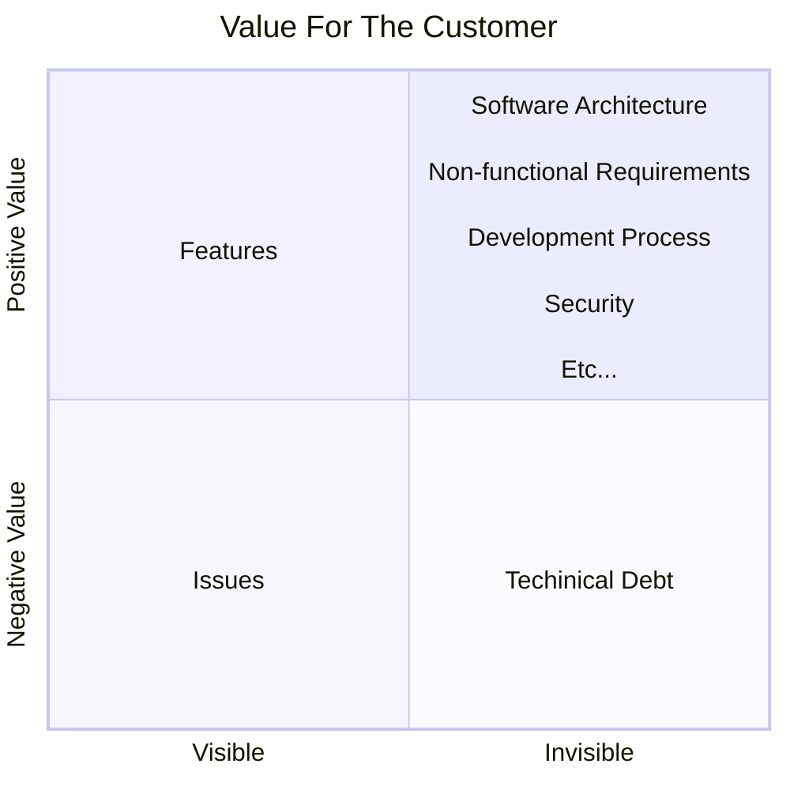

*30 June 2025*

The term DevSecOps is widely used in the software development world — but what does it really mean? As we know, the term stands for Development, Security, and Operations. However, we often see many different definitions of DevSecOps: an approach, a framework, a culture, a software development practice, a process, and so on.

In my opinion, all of these definitions are valid. Roughly speaking, I understand DevSecOps as a set of processes and practices that define how companies deliver value through software.

It's common for all of us to experience a downward spiral among the main stakeholders in this game called software development. The project team creates tasks based on user or business requests and wants them delivered as soon as possible. The development team wants to deliver new features and fixes requested by the project team — but these changes may introduce new security and performance risks. The security team wants to prevent these risks. The operations team fears changes, as they can cause downtime or performance issues.

As a result, the main effect of this downward spiral is delivery cycles under constant pressure, generating releases full of issues, and making the process slower and slower — ultimately leading to dissatisfied customers and a burned-out team.

With a DevSecOps mindset, we can reflect on our current processes and practices to find better ways to improve our daily work across different areas of IT. Developers need to feel more confident and autonomous when implementing and deploying features. The operations team shouldn’t have to touch the code or deploy it manually — the deployment process should be automated. The security team must feel confident with each release because they know any potential vulnerabilities were reviewed during deployment. And the project team must be sure they’re delivering the right features at the right time. If something goes wrong, no problem — the team will be ready to deploy a new release without a headache. This is the ideal world we aim for.

In the next sections, we’ll explore how to build a path toward this ideal — but always with our feet on the ground, because things are never as simple as they seem.

## How to Start

First of all, I recommend understanding the health and habits of the organization with regard to software development. During this assessment, we may begin to map some initial qualitative and quantitative indicators. As Peter Drucker said:
>  *If you can't measure it, you can't improve it.*

Some quantitative indicators to look at:
- Throughput metrics
- Production deployments
- Code and change deployments
- Reliability
- Average time to deploy into production

The [DORA Metrics "Four Keys"](https://dora.dev/guides/dora-metrics-four-keys/) is a great guide for this, by the way.

Some qualitative indicators to consider:
- Is the team satisfied with the current software development process and practices?
- Can the team deploy a release during working hours without worry? If not, what’s blocking them?
- Can the project team confidently trigger a new release?
- Is it necessary to involve multiple people to deploy a new release? Are all of them contributing during the process?

Take note of the qualitative insights you uncover, and create a simple and lightweight process to monitor the quantitative indicators. This is a great way to start, because you'll gain visibility into what is affecting your organization’s software development cycle. With this knowledge, you'll be in a better position to initiate conversations with the team to collaboratively improve processes and practices. But be careful of common pitfalls:
- [Goodhart's law](https://en.wikipedia.org/wiki/Goodhart%27s_law) — *"When a measure becomes a target, it ceases to be a good measure"*. In short, don't make indicators your final goal. Always consider the project's and the organization’s context when setting targets.
- **Market benchmarking traps** — It’s easy to find articles about tech companies performing hundreds or even thousands of deployments per day. But in most cases, that scale isn’t necessary for the majority of companies. Chasing that volume without clear purpose can do more harm than good.
- **Using bureaucracy or regulation as a shield** — In industries like banking or government, it’s common to use regulatory or bureaucratic requirements to justify bad indicators or delay improvements. This mindset prevents real progress.
- **Prioritizing tools over processes** — Don’t start with tools. Focus first on improving processes and practices. Try to make the most of the tools already available in your organization — it’s a good way to achieve quick wins.

And my final advice on this topic is to map the organization's main value stream. This is a great way to gain a macro-level view of how requests arise and how they evolve throughout the process to generate value for customers. I also like to use the following quadrant to reflect on what “value” may mean to the customer.

## Finding Ways to Improve Your Environment

As a result of [How To Start](#how-to-start), you will be ready to find your way on the journey of DevSecOps implementation in your organization. First of all, you must act as an influencer of this movement. You will need management support — this is very important because it helps spread the culture throughout the organization and assists in resolving friction that may arise with teams along the way. If management does not pay attention to these actions, the initiative will probably fail.

It is common for teams to create bureaucratic barriers to protect and perpetuate current processes, which may have been successful in the past. Some examples include requests for approvals from specific individuals, deployments supervised by people unrelated to the process, and change management processes with many layers.

Next, you need to find the **right people** — those who will help you as DevSecOps agents inside the organization. Not everyone is willing to discuss the current processes and practices, much less willing to change something that might push them out of their comfort zone. With a great "transformation team", you will be able to run many experiments, deeply discuss solutions to improve DevSecOps, and define new practices that other teams can adopt later. Try to include people from different areas in this team — project management, development, operations, security, and business. All the learnings, processes, and practices created will begin to shape a new culture in the organization. Little by little, your company’s environment will start to change. The more diverse your “transformation team”, the smoother the change process will be.

Finally, it is important to give attention to work visibility. Create simple documentation about every process or practice reviewed, and update the documents with more detailed information as needed. These documents should be shared with other teams, and the status of the work should be clear (Draft, Work in Progress, Stable, Deprecated). For Work in Progress and Stable changes, you and your team can use your influence to find opportunities to improve other teams’ work and suggest adopting the new model. Another way to increase visibility is by showcasing your team’s outcomes, which may encourage others to seek similar results.

## Continuous Improvement

Once your organization reaches DevSecOps maturity across all teams, it’s time to enter the PDCA (Plan, Do, Check, Act) cycle. At this point, the main value stream process will be mapped — enabling you to create clear improvement plans. Your company will be measuring key indicators, which will help define clear goals for change and determine when to act. Additionally, the teams will have embraced the cultural change, making the propagation of improvements easier and more fluid.

DevSecOps benefits will spread to everyone, resulting in fewer weekends and holidays missed, less overtime, more predictable work, and, of course, the delivery of great products!

> *DevSecOps enables teams to work together to survive, learn, thrive, delight our customers, and help the organization succeed. (The DevOps Handbook)*

## Find the "Right" Tools

The least important, for me, is finding the right tools to operationalize the DevSecOps process. Today, we have many options across different areas. Companies commonly have their technology stacks and assignments of some paid product licenses. It’s a good idea to try to use what you have on hand, and if none of the tools meet your needs, it’s worth looking at open-source projects that may help you. Purchasing new paid tools should be the last option because the acquisition process is usually slower.

With clear and documented processes and practices, it will be easy to choose your tools, benchmark them, and also search for better options. Don’t lock in your DevSecOps process by shaping it around the features offered by the tools you use. Do the opposite: your tools should meet the requirements of your process.

Below, I will provide a list of tools that may be useful to meet your process requirements:

**CI/CD**
- [Gitlab CI/CD](https://docs.gitlab.com/ci/)
- [Github CI/CD](https://github.com/solutions/use-case/ci-cd)

**Code Quality**
- [SonarQube](https://www.sonarsource.com/products/sonarqube/)

**Cluster Kubernetes Manegement**
- [Rancher](https://www.rancher.com/)

**Infraestructure as a Code**
- [Terraform](https://developer.hashicorp.com/terraform)
- [Opentofu](https://opentofu.org/)
- [AWS CloudFormation](https://docs.aws.amazon.com/AWSCloudFormation/latest/UserGuide/Welcome.html)

**Issue Traking**
- [Sentry](https://sentry.io/welcome/)

**Monitoring**
- [Prometheus](https://prometheus.io/)
- [Grafana](https://grafana.com/)

**Project Manegement**
- [JIRA](https://www.atlassian.com/br/software/jira)
- [Gitlab Plan](https://about.gitlab.com/stages-devops-lifecycle/plan/)

**Security Analysis**
- [Semgrep](https://semgrep.dev/)
- [OWASP Dependecy Check](https://owasp.org/www-project-dependency-check/)
- [ZAP](https://www.zaproxy.org/)
- [Gitleaks Secret Detection](https://github.com/gitleaks/gitleaks)
- [Trivy Scan](https://github.com/aquasecurity/trivy)

**Security Management**
- [DefectDojo](https://defectdojo.com/)

## Suggested Reading

Forsgren, Nicole, Jez Humble, and Gene Kim. *Accelerate: The Science of Lean Software and DevOps – Building and Scaling High Performing Technology Organizations*. IT Revolution Press, 2018.

Kim, Gene, et al. The DevOps Handbook: *How to Create World-Class Agility, Reliability, & Security in Technology Organizations. 2nd ed.*, IT Revolution Press, 2021.

***That's all folks!*** 👋
