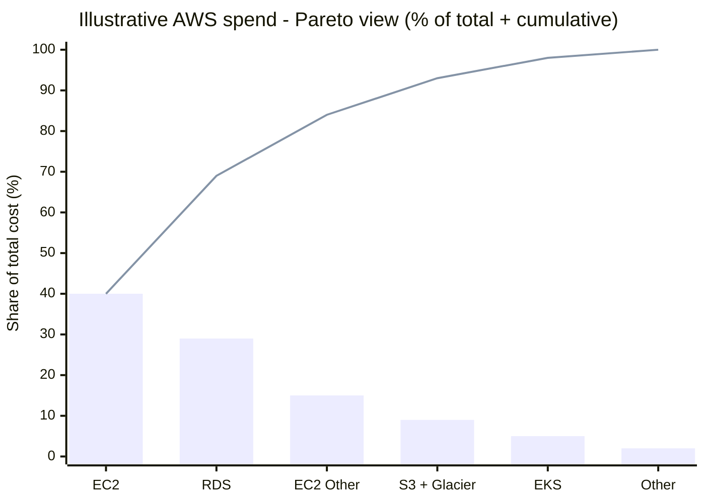
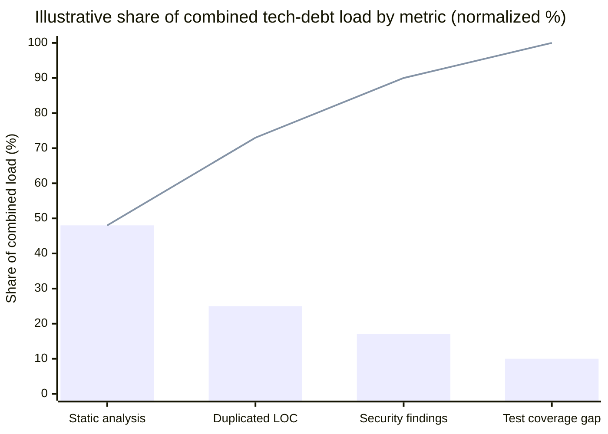

*15 Apr 2026*

Pareto's principle, also known as the 80/20 rule, states that 80% of effects come from just 20% of causes. This statement came from the observation of the Italian economist Vilfredo Pareto, who noted that roughly 80% of land was owned by 20% of the population. This behaviour can also be observed in many other areas, including computing. In this context I'll list some experiences that I've already had using this principle as a guide to prioritize my efforts on specific types of tasks.

In system development time is gold and all efforts to assertively prioritize activities are welcome. I'm used to applying Pareto's principle while planning my activities when tasks have multiple causes to address. This does not serve as a rule for me, but rather as a guide to where I should focus my initial efforts.

Based on my experience this planning helps to deliver more outcomes first and prioritize the activities that will in fact affect issue resolution. To put this in practice follow these four steps:
1. Define your goal (reduce costs, optimize load, increase customer experience, etc)
2. Get the metrics that track your goal.
3. Plot the current state.
4. Prioritize your effort based on Pareto's principle.

Next I'll bring some paths that I'm used to putting into practice when I encounter problems in certain areas.

## Infrastructure

A common case of Pareto's usage in infrastructure scope is when I'm evaluating costs or resource usage optimization. When we plot our billing, it is very common to see a plot like this:

As we can see the three first categories of costs represent almost 80% of total cost. Given this, the question I ask myself is, does it make sense to strive to optimize the other items in the first instance?

Digging deeper on the 80% of total costs will produce more outcomes than focusing on optimizing small pieces of infrastructure waste. But don't misunderstand me: here I'm talking about prioritizing; these small wastes should be tracked and fixed at a later time.

## Software Development

In software development we can use this principle mainly for issue fixes, technical debt, query optimization and product features.

### Issue fixes

In this context I'm used to classifying issues by class of problem like: slow queries, N+1 problem, error handling, and many other classes of problems and [anti-patterns](https://en.wikipedia.org/wiki/List_of_software_anti-patterns). So, in this case it's a little hard, because we depend on the right classification in your bug tracking system. And this type of activity, generally, does not reach the developer's hand at first. Someone on the support system will track the issue and would be able to classify the issue. If the support team wasn't able to classify it you will need to do it yourself; this may cost you some time at first, but the outcome will be worth it.

### Tech Debt

I am a proponent of the [clean as you code methodology](https://docs.sonarsource.com/sonarqube-server/9.8/user-guide/clean-as-you-code#understanding-the-benefits-of-clean-as-you-code). But sometimes we want to make some big refactor or focus on tech debt improvements. In these cases we need to keep track of some important metrics to prioritize our efforts like: security findings, static code analysis, lines of code duplicated and tests coverage.

The main idea is to relate these metrics to the system components. Pareto reasoning then applies at **two levels**: comparing **metric types** on one common scale (where does most of the load live?), and, for each metric, comparing **modules** (who owns most of that load?). Without a shared yardstick across tools-story points, estimated fix time, a weighted score, or normalized counts-cross-metric comparison is misleading, so you pick one explicit rule and stick to it.

**Metric comparison (illustrative).** After normalizing, the bars below are sorted so the largest contributors sit on the left; the line is the **cumulative share** of the combined load. Here the first **two** metric types already explain about **three quarters** of the total, which is the same “few categories dominate” pattern as the cost example earlier.

**Module mix within each metric.** The next figure fixes a metric on the **x-axis** and stacks **ERP modules** on the **y-axis** as **share of that metric (%)**.

<svg xmlns="http://www.w3.org/2000/svg" viewBox="0 0 520 290" role="img" aria-labelledby="techdebt-title techdebt-desc">
  <title id="techdebt-title">ERP tech debt by metric (illustrative)</title>
  <desc id="techdebt-desc">Three stacked columns for security findings, static analysis findings, and duplicated lines of code; each column sums to 100 percent across five ERP modules.</desc>
  <text x="260" y="22" text-anchor="middle" font-size="14" font-family="system-ui,sans-serif" fill="currentColor">ERP tech debt by metric - share per module (illustrative %)</text>
  <text transform="rotate(-90 18 124)" x="18" y="124" text-anchor="middle" font-size="11" font-family="system-ui,sans-serif" fill="currentColor">Share of metric (%)</text>
  <g font-family="system-ui,sans-serif" font-size="10" fill="currentColor">
    <text x="95" y="232" text-anchor="middle">Security findings</text>
    <text x="260" y="232" text-anchor="middle">Static analysis findings</text>
    <text x="425" y="232" text-anchor="middle">Duplicated lines of code</text>
  </g>
  <g stroke="currentColor" stroke-opacity="0.35" stroke-width="0.5">
    <line x1="48" y1="204" x2="472" y2="204"/>
    <line x1="48" y1="124" x2="472" y2="124" stroke-dasharray="4 3"/>
    <line x1="48" y1="44" x2="472" y2="44" stroke-dasharray="4 3"/>
  </g>
  <g font-size="9" font-family="system-ui,sans-serif" fill="currentColor">
    <text x="40" y="208" text-anchor="end">0</text>
    <text x="40" y="128" text-anchor="end">50</text>
    <text x="40" y="48" text-anchor="end">100</text>
  </g>
  <!-- Security: 55, 30, 8, 5, 2 - bottom to top -->
  <rect x="59" y="116" width="72" height="88" fill="#2563eb"/>
  <rect x="59" y="68" width="72" height="48" fill="#7c3aed"/>
  <rect x="59" y="55.2" width="72" height="12.8" fill="#059669"/>
  <rect x="59" y="47.2" width="72" height="8" fill="#d97706"/>
  <rect x="59" y="44" width="72" height="3.2" fill="#dc2626"/>
  <!-- Static analysis: 47, 37, 10, 5, 1 -->
  <rect x="224" y="128.8" width="72" height="75.2" fill="#2563eb"/>
  <rect x="224" y="69.6" width="72" height="59.2" fill="#7c3aed"/>
  <rect x="224" y="53.6" width="72" height="16" fill="#059669"/>
  <rect x="224" y="45.6" width="72" height="8" fill="#d97706"/>
  <rect x="224" y="44" width="72" height="1.6" fill="#dc2626"/>
  <!-- Duplicated LOC: 52, 27, 9, 7, 5 -->
  <rect x="389" y="120.8" width="72" height="83.2" fill="#2563eb"/>
  <rect x="389" y="77.6" width="72" height="43.2" fill="#7c3aed"/>
  <rect x="389" y="63.2" width="72" height="14.4" fill="#059669"/>
  <rect x="389" y="52" width="72" height="11.2" fill="#d97706"/>
  <rect x="389" y="44" width="72" height="8" fill="#dc2626"/>
  <g font-family="system-ui,sans-serif" font-size="9" fill="currentColor">
    <rect x="69" y="254" width="10" height="10" fill="#2563eb"/><text x="83" y="263">Finance</text>
    <rect x="143" y="254" width="10" height="10" fill="#7c3aed"/><text x="157" y="263">Supply chain</text>
    <rect x="248" y="254" width="10" height="10" fill="#059669"/><text x="262" y="263">HR</text>
    <rect x="295" y="254" width="10" height="10" fill="#d97706"/><text x="309" y="263">CRM</text>
    <rect x="349" y="254" width="10" height="10" fill="#dc2626"/><text x="363" y="263">Manufacturing</text>
  </g>
</svg>

In this example split, **finance** and **supply chain** together account for most of each metric (about **85% / 84% / 79%**), so prioritizing those two modules matches the 80/20 idea even when the absolute counts differ a lot between tech debt metrics. Together, the two plots suggest a practical sequence: align on **which metrics matter most** on a normalized scale, then attack the **dominant modules** inside those metrics first.

### Query Optimization

This is one of the areas where I have benefited most from this principle over the years. When our databases are overloaded we need to find effective actions to fix the queries and return to normal status. In this case we will need a tool that monitors our queries. There are many good commercial and open-source solutions, so it's easy to find a solution to collect the metrics.

In this case, I'm used to using a metric based on **query quantity** and **time to execute**. In the tools, this metric is usually called **Total Cost** or **Duration**. This metric is sufficient to show us which queries we need to put effort into first to lighten our database.

However, this context is more complex compared to others listed before and we must be careful because when plotting the queries, we are seeing a snapshot in time, and in this case, further understanding is necessary. The graph may be showing us the effect at the moment and not the causes of the overload.

## Suggested Reading

Institute of Project Management. *The Pareto Principle*. 2025. Institute of Project Management, https://projectmanagement.ie/blog/the-pareto-principle/. Accessed 15 April 2026.

***That's all folks!*** 👋